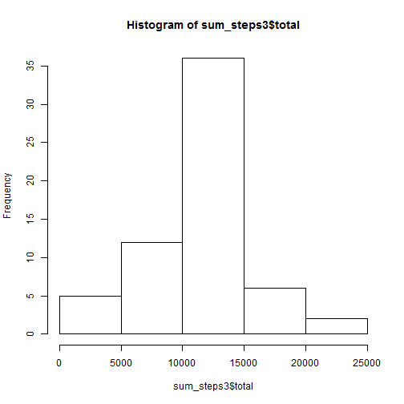
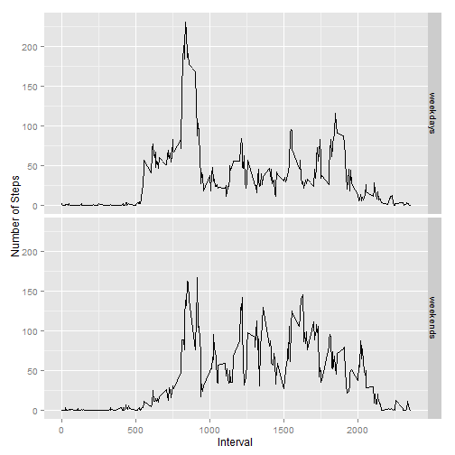

# Reporting the questions of peer assignment 1 

The data for this assignment can be downloaded from the course web site:
.Dataset: [Activity monitoring data [52K]](https://d396qusza40orc.cloudfront.net/repdata%2Fdata%2Factivity.zip)

Because we have to always use echo = TRUE, I´m setting my global options to echo=TRUE. Now I don`t have to write it always explicitly. I had to load knitr for that.


```r
library(knitr)
opts_chunk$set(echo=TRUE)
```
### Loading and reading the data:


```r
## To load URL with https in RMarkdown I have to use special settings
setInternet2(use = TRUE)

temp <- tempfile()
download.file("https://d396qusza40orc.cloudfront.net/repdata%2Fdata%2Factivity.zip",temp)
activity <- read.csv(unz(temp, "activity.csv"))
unlink(temp)
```
First question:
----------------

### What is mean total number of steps taken per day?

1. Calculate the total number of steps taken per day 

        To sum up total steps per day, I had to group the dates. I used dplyr package for that.

2. Make a histogram of the total number of steps taken each day

3. Calculate and report the mean and median of the total number of steps   taken per day. 
        
        As there are missing values I ignored them to have more exact results. I rounded my results with signif to set the values correct to two decimal places.


```r
## 1.
library(dplyr)
sum_steps<-activity%>%group_by(date)%>%summarise(total=sum(steps))

## 2.
hist(sum_steps$total)
```

 

```r
## 3.
options("scipen"=100) ## to avoid exponetial notation
signif(median(sum_steps$total,na.rm=TRUE))
```

```
## [1] 10765
```

```r
signif(mean(sum_steps$total,na.rm=TRUE),digits=7)
```

```
## [1] 10766.19
```

Second Question:
-----------------

### What is the average daily activity pattern?
1. Make a time series plot (i.e. type = "l") of the 5-minute interval (x-axis) and the average number of steps taken, averaged across all days (y-axis)
    
        To take the mean of all steps per interval, I had to group the intervals.

2. Which 5-minute interval, on average across all the days in the dataset, contains the maximum number of steps?


```r
## 1.
sum_steps2<-activity%>%group_by(interval)%>%summarise(average=mean(steps,na.rm=TRUE))
plot(sum_steps2$interval,sum_steps2$average,type="l",xlab="Interval",ylab="Average number of steps taken, averaged across all days")
```

 

```r
## 2.
max(sum_steps2$average)
```

```
## [1] 206.1698
```

Third Question:
----------------

### Imputing missing values

1.Calculate and report the total number of missing values in the dataset (i.e. the total number of rows with NAs)

```r
missing_values<-sum(is.na(activity))
```

The total number of missing values in the data set is 2304

2.Devise a strategy for filling in all of the missing values in the dataset. The strategy does not need to be sophisticated. For example, you could use the mean/median for that day, or the mean for that 5-minute interval, etc.

        I took the mean of the intervals to fill the NA's, because I couldn't take the mean of the steps, 
        first day don`t have any steps recorded.

3.Create a new dataset that is equal to the original dataset but with the missing data filled in.


```r
activity2<-mutate(activity, steps = replace(activity$steps, is.na(activity$steps), sum_steps2$average))
```


4.Make a histogram of the total number of steps taken each day and Calculate and report the mean and median total number of steps taken per day. Do these values differ from the estimates from the first part of the assignment? What is the impact of imputing missing data on the estimates of the total daily number of steps?

        For making the histogram and calculating mean and median, I used the same way as I did in the first
        question, but with the new dataset


```r
sum_steps3<-activity2%>%group_by(date)%>%summarise(total=sum(steps))
hist(sum_steps3$total)
```

 

```r
options("scipen"=100)
signif(median(sum_steps3$total,na.rm=TRUE))
```

```
## [1] 10766.2
```

```r
signif(mean(sum_steps3$total,na.rm=TRUE),digits=7)
```

```
## [1] 10766.19
```

The values barely differ from the estimates from the first part of the assignment:

In the first part we had: 

10765 and 10766.19

Now we have:

10766.2 and 10766.19

There is no impact of imputing missing data on the estimates of the total daily number of steps.

4. Question:
------------

### Are there differences in activity patterns between weekdays and weekends?


1.Create a new factor variable in the dataset with two levels - "weekday" and "weekend" indicating whether a given date is a weekday or weekend day.

        To set up the factor variable, I had to convert the date variable into a real date, it was a
        factor variable before. Then I created weekdays with the weekdays function. My weekdays are labeled in 
        German language.
        I used the recode function from the basis package car to generate two labels 
        "weekdays" and "weekends". I made a factor with this two levels using the factor variable.
        I had to convert this new built variable into a dataframe so I could use the bind_cols function from 
        package dpylr to create the new dataset.
        

```r
library(car)
date<-strptime(activity2$date,format="%Y-%m-%d")
weekdays<-weekdays(date)
wday_fac<-recode(weekdays,"c('Samstag','Sonntag')='weekends';else='weekdays'")
wday_fac<-factor(wday_fac)
wday_fac<-data.frame(wday_fac)
activity2<-bind_cols(activity2,wday_fac)
```

2.Make a panel plot containing a time series plot (i.e. type = "l") of the 5-minute interval (x-axis) and the average number of steps taken, averaged across all weekday days or weekend days (y-axis).
        
        First I did the same steps as in the second question to take the mean of all steps per interval, 
        but with the new dataset.
        I loadet ggplot2 to do the plot, because I could use the facets argument of the qplot function to 
        show the two plots (weekdays and weekends). 

```r
sum_steps4<-activity2%>%group_by(interval,wday_fac)%>%summarise(average=mean(steps,na.rm=TRUE))
library(ggplot2)
qplot(interval,average,data=sum_steps4,facets=wday_fac~.,geom=c("line"),xlab="Interval",ylab="Number of Steps")
```

 
